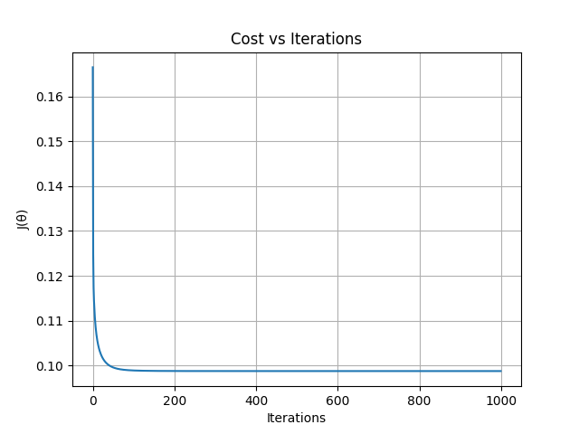
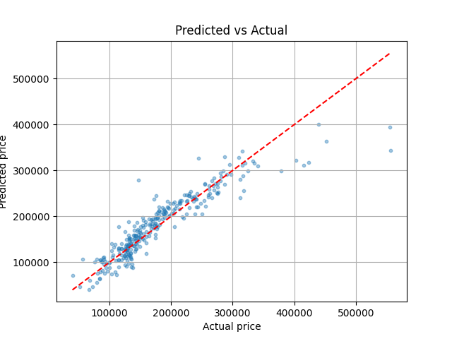

# Small ML project, House price predictions
Linear regression implemented from scratch, and used scikit-learn later, for learning purposes

## Results
|Model   |Val RMSE   |Val R² |
|--------|-----------|-------|
| Linear Regression **(scratch)** | $30,503 | 0.8476   
| **sklearn** LinearRegression       | $30,503 | 0.8476

## Approach
1. **Data cleaning**: by selecting numeric fetaures, dropping column that had >5% missing values.
2. **Feature scaling**: used **z-score** normalization.
3. **Target scaling**: normalized SalePrice too to stabilize gradient descent.
4. **Model**: used LinearRegression model trained with BGD (batch gradient descent).
5. **Evaluation**: Used Root mean squared error (RMSE) and R² on validation set (20%).

## Project structure
Project initialized with **uv init**
```text
house-predict/
├── data
│   └── train.csv # Kaggle dataset
├── main.py # main entry file + sklearn function
├── manual.ipynb #notebook file for trying
├── outputs
│   ├── cost_curve.png 
│   └── predictions.png
├── pyproject.toml
├── README.md
├── src
│   ├── data.py # Loading, cleaning and normalizing data
│   ├── model.py # predict, compute_cost, compute_gradient
│   ├── train.py # gradient_descent and evaluate
│   └── utils.py # rmse, r_squared, plot helps
└── uv.lock
```
## Quickstart
``` bash
git clone https://github.com/saliims/house-predict.git
cd house-predict

# install dependencies
uv sync

# Download dataset

# Run
uv run main.py
```

## Training
### Cost curve


### Predictions vs Actual


## Key concepts implemented
- Hypothesis: ŷ = Xθ
- Cost function: J(θ) = 1/(2m) · ‖Xθ − y‖²
- Gradient: ∇J = (1/m) · Xᵀ(Xθ − y)
- Update rule: θ := θ − α · ∇J
- L2 regularization (Ridge): J += λ/(2m) · Σθⱼ²

## Dataset
[House Prices Dataset Kaggle](https://www.kaggle.com/competitions/house-prices-advanced-regression-techniques/data) (Kaggle)

1,460 samples · 81 features · target: `SalePrice`